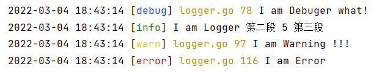
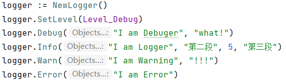

# dinglog

```sh
go get -u github.com/dingdinglz/dingtools/dinglog
```

支持函数列表

| 函数名        | 描述                              |
| ------------- | --------------------------------- |
| NewLogger     | 新建一个DingLogger组件            |
| SetLevel      | 设置日志等级                      |
| SetTimeFormat | 设置时间输出格式（同time.format） |
| Logger.Info   | Info方法                          |
| Logger.Debug  | Debug方法                         |
| Logger.Error  | Error方法                         |
| Logger.Warn   | Warn方法                          |

## 展示



